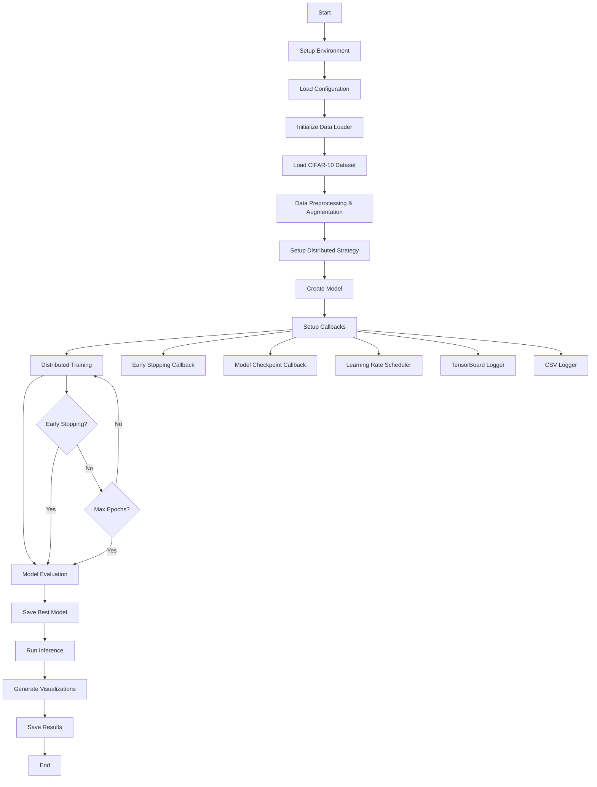

# TensorFlow Distributed Training for CIFAR-10

A comprehensive distributed training and inference system for the CIFAR-10 dataset using TensorFlow. This project implements distributed training across multiple GPUs with advanced features including early stopping, model checkpointing, learning rate scheduling, and comprehensive visualization.

## 🚀 Features

- **Distributed Training**: Support for multi-GPU training using TensorFlow's distribution strategies
- **Multiple Model Architectures**: ResNet, Custom CNN, and EfficientNet variants
- **Advanced Callbacks**: Early stopping, model checkpointing, learning rate scheduling, TensorBoard logging
- **Data Augmentation**: Comprehensive data augmentation for improved model generalization
- **Comprehensive Evaluation**: Detailed evaluation metrics and confusion matrix analysis
- **Visualization**: Training history plots, confusion matrices, confidence distributions
- **Inference Pipeline**: Complete inference system with confidence scoring and result visualization
- **Modular Design**: Clean, modular codebase with separate components for data loading, training, and inference

## 📊 Project Flowchart



## 🏗️ Architecture

### Core Components

1. **Configuration (`config.py`)**: Centralized configuration management
2. **Data Loader (`data_loader.py`)**: CIFAR-10 dataset loading and preprocessing
3. **Models (`models.py`)**: Model architectures (ResNet, CNN, EfficientNet)
4. **Distributed Trainer (`distributed_trainer.py`)**: Distributed training orchestration
5. **Callbacks (`callbacks.py`)**: Training callbacks and monitoring
6. **Inference (`inference.py`)**: Model inference and evaluation
7. **Visualization (`visualization.py`)**: Training and evaluation visualizations
8. **Main Script (`main.py`)**: Complete training pipeline

## 📦 Installation

### Prerequisites

- Python 3.8+
- TensorFlow 2.12+
- CUDA-compatible GPU (optional, for GPU acceleration)

### Install Dependencies

```bash
pip install -r requirements.txt
```

### Verify Installation

```bash
python -c "import tensorflow as tf; print(f'TensorFlow version: {tf.__version__}')"
```

## 🚀 Usage

### Basic Training

```bash
# Train ResNet model with default settings
python main.py --model-type resnet

# Train Custom CNN with custom parameters
python main.py --model-type cnn --epochs 50 --batch-size 64 --learning-rate 0.0001

# Train EfficientNet
python main.py --model-type efficientnet --epochs 100
```

### Advanced Usage

```bash
# Load existing model and continue training
python main.py --model-type resnet --load-model checkpoints/best_model.h5

# Skip training, only run inference
python main.py --skip-training --load-model checkpoints/best_model.h5

# Skip inference, only train
python main.py --skip-inference

# Skip visualization
python main.py --skip-visualization
```

### Command Line Arguments

| Argument | Type | Default | Description |
|----------|------|---------|-------------|
| `--model-type` | str | "resnet" | Model architecture (resnet, cnn, efficientnet) |
| `--epochs` | int | 100 | Number of training epochs |
| `--batch-size` | int | 128 | Training batch size |
| `--learning-rate` | float | 0.001 | Learning rate |
| `--load-model` | str | None | Path to load existing model |
| `--skip-training` | flag | False | Skip training phase |
| `--skip-inference` | flag | False | Skip inference phase |
| `--skip-visualization` | flag | False | Skip visualization phase |

## 📁 Project Structure

```
TENSORFLOW_CIFAR/
├── config.py                 # Configuration management
├── data_loader.py           # Data loading and preprocessing
├── models.py                # Model architectures
├── distributed_trainer.py   # Distributed training orchestration
├── callbacks.py             # Training callbacks
├── inference.py             # Inference and evaluation
├── visualization.py         # Visualization utilities
├── main.py                  # Main training script
├── requirements.txt         # Python dependencies
├── README.md               # Project documentation
├── checkpoints/            # Model checkpoints
├── logs/                   # Training logs
├── results/                # Training results and visualizations
└── data/                   # Dataset storage
```

## 🔧 Configuration

The system uses a centralized configuration system in `config.py`. Key configuration options:

### Training Configuration
- `BATCH_SIZE`: Training batch size (default: 128)
- `EPOCHS`: Number of training epochs (default: 100)
- `LEARNING_RATE`: Initial learning rate (default: 0.001)
- `EARLY_STOPPING_PATIENCE`: Early stopping patience (default: 15)

### Model Configuration
- `MODEL_TYPE`: Model architecture (default: "resnet")
- `DROPOUT_RATE`: Dropout rate for regularization (default: 0.3)
- `REGULARIZATION_FACTOR`: L2 regularization factor (default: 1e-4)

### Distributed Training Configuration
- `STRATEGY`: Distribution strategy (default: "mirrored")
- `NUM_GPUS`: Number of GPUs to use (default: 2)

## 📊 Model Architectures

### ResNet
- Residual connections for better gradient flow
- Batch normalization and dropout for regularization
- Optimized for CIFAR-10 image size (32x32)

### Custom CNN
- Deep convolutional architecture
- Multiple convolutional blocks with pooling
- Dense layers with dropout for classification

### EfficientNet
- Pre-trained EfficientNetB0 as feature extractor
- Transfer learning approach
- Fine-tuned for CIFAR-10 classification

## 📈 Training Features

### Callbacks
- **Early Stopping**: Prevents overfitting by monitoring validation loss
- **Model Checkpointing**: Saves best model based on validation metrics
- **Learning Rate Scheduling**: Reduces learning rate on plateau
- **TensorBoard Logging**: Real-time training monitoring
- **CSV Logging**: Detailed training history

### Data Augmentation
- Random rotation (±15 degrees)
- Random translation (±10%)
- Random zoom (±10%)
- Random horizontal flip
- Normalization to [0, 1] range

### Evaluation Metrics
- Accuracy (overall and per-class)
- Top-3 accuracy
- Confusion matrix
- Confidence distribution analysis

## 🎯 Performance

### Expected Results
- **ResNet**: ~85-90% test accuracy
- **Custom CNN**: ~80-85% test accuracy
- **EfficientNet**: ~90-95% test accuracy

### Training Time
- Single GPU: ~2-4 hours for 100 epochs
- Multi-GPU: ~1-2 hours for 100 epochs (depending on GPU count)

## 📊 Output Files

### Training Outputs
- `checkpoints/best_model.h5`: Best model weights
- `checkpoints/latest_model.h5`: Latest model weights
- `logs/training_log_*.csv`: Training history
- `logs/tensorboard/`: TensorBoard logs

### Visualization Outputs
- `results/training_history.png`: Training curves
- `results/confusion_matrix.png`: Confusion matrix
- `results/class_accuracy.png`: Per-class accuracy
- `results/prediction_samples.png`: Sample predictions
- `results/confidence_distribution.png`: Confidence analysis

### Results Files
- `results/training_summary.json`: Training summary
- `results/training_history.json`: Complete training history
- `results/inference_results.json`: Inference evaluation results

## 🔍 Monitoring Training

### TensorBoard
```bash
tensorboard --logdir logs/tensorboard
```

### Real-time Monitoring
- Training and validation loss/accuracy
- Learning rate changes
- Model parameter statistics
- Data augmentation samples

## 🛠️ Troubleshooting

### Common Issues

1. **GPU Memory Issues**
   - Reduce batch size
   - Enable GPU memory growth
   - Use mixed precision training

2. **Training Not Converging**
   - Adjust learning rate
   - Increase model capacity
   - Check data preprocessing

3. **Overfitting**
   - Increase dropout rate
   - Add more regularization
   - Reduce model complexity

### Performance Optimization

1. **Data Pipeline**
   - Use `tf.data` for efficient data loading
   - Enable prefetching and caching
   - Optimize data augmentation

2. **Model Optimization**
   - Use mixed precision training
   - Optimize model architecture
   - Use appropriate distribution strategy

## 🤝 Contributing

1. Fork the repository
2. Create a feature branch
3. Make your changes
4. Add tests if applicable
5. Submit a pull request

## 📄 License

This project is licensed under the MIT License - see the LICENSE file for details.

## 🙏 Acknowledgments

- TensorFlow team for the excellent distributed training framework
- CIFAR-10 dataset creators
- Open source community for various tools and libraries

## 📞 Support

For issues and questions:
1. Check the troubleshooting section
2. Review the documentation
3. Open an issue on GitHub

---

**Happy Training! 🚀**